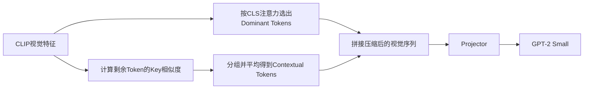

# VisionZip-Jittor

这是我用 **Jittor** 复现 CVPR 2025 论文 **VisionZip: Longer is Better but Not Necessary in Vision Language Models** 的项目。复现的重点是 VisionZip 的视觉 Token 压缩方法，以及它接入真实 CLIP、Projector 和语言模型后的基本训练与推理流程。

- 论文：[CVF Open Access](https://openaccess.thecvf.com/content/CVPR2025/html/Yang_VisionZip_Longer_is_Better_but_Not_Necessary_in_Vision_Language_CVPR_2025_paper.html)
- 官方实现：[JIA-Lab-research/VisionZip](https://github.com/JIA-Lab-research/VisionZip)
- 本项目提交版：[v0.1.0-jittor-submission](https://github.com/thermosship/VisionZip-Jittor/releases/tag/v0.1.0-jittor-submission)

受计算资源和时间限制，我没有重跑论文中的全部 LLaVA-7B/13B 任务，而是把工作集中在以下几部分：

1. 用 Jittor 实现 Dominant Token Selection 和 Contextual Token Merging；
2. 使用真实 `CLIP-ViT-L/14-336` 特征，与独立 PyTorch 参考实现进行对比；
3. 导入 GPT-2 Small 权重，完成原生 Jittor 前向、Projector-only 训练和 KV-cache；
4. 在 8,192 组 CC-BY 图文数据上进行小规模训练，记录 Loss、显存和速度。


## 1. 方法简介

视觉语言模型通常会把一张图片编码为数百个视觉 Token。论文观察到，这些 Token 中有一部分对后续生成更重要，另外一些 Token 的信息比较相似，因此没有必要把完整序列全部送入语言模型。

本项目实现时对照了官方仓库 `main` 分支的 `8f86b55c6f000eb033e6912538af2dd7dcb30502` 提交，具体对应关系记录在 [`references/UPSTREAM.md`](references/UPSTREAM.md)。压缩过程分为两步。

### 1.1 Dominant Token Selection

1. 从 CLIP 倒数第二层读取隐藏状态、注意力和 Key 特征；
2. 汇总 CLS Token 对各个 Patch Token 的多头注意力；
3. 根据注意力分数选出更受 CLS 关注的 Patch；
4. 保留 CLS，并把选中的 Patch 恢复为原图中的顺序。

这里需要特别注意最后一步。Top-K 返回的是一个集合，但语言模型接收的是有顺序的视觉序列。如果只保证选中的位置相同，却打乱了原始 Patch 顺序，后面的 Projector 和语言模型仍会得到不同输入。

### 1.2 Contextual Token Merging

未被选中的 Patch 不会全部丢弃。代码会从剩余 Token 中均匀选择若干目标位置，再按照归一化 Key 的余弦相似度，把其他 Token 分配到最近的目标上，最后对同组隐藏状态求平均，得到 Contextual Tokens。



### 1.3 Token 预算

配置中的预算不包含 CLS，因此实际输出长度要再加 1。

| 配置 | Dominant | Contextual | 预算（不含 CLS） | 实际输出 |
|---|---:|---:|---:|---:|
| `visionzip_64.json` | 54 | 10 | 64 | 65 |
| `visionzip_128.json` | 108 | 20 | 128 | 129 |
| `visionzip_192.json` | 162 | 30 | 192 | 193 |

其中 `54 + 10` 来自官方 README；128 和 192 是本项目为了观察不同长度而按比例增加的配置，不把它们当作论文给出的正式划分。

## 2. 这次复现做了什么

- VisionZip 核心压缩逻辑及边界情况测试；
- 真实 CLIP 三档 Token 预算的 PyTorch/Jittor 对比；
- Token 选择与合并结果可视化；
- `1024 -> 768 -> 768` 的 Jittor Projector；
- Hugging Face GPT-2 Small 权重导出和原生 Jittor 加载；
- 图像 Token、文本 Token 和 Label 的多模态序列拼接；
- 只更新 Projector 的训练、验证、checkpoint 和断点恢复；
- GPT-2 KV-cache 生成及 cached/uncached 路径对比；
- Loss 曲线、运行时间、吞吐和显存记录。

更细的排查和实验记录放在 [`docs/`](docs/) 中，README 这里只列主要运行方法和结果。

## 3. 环境配置

### 3.1 已测试环境

| 组件 | 版本 |
|---|---|
| 操作系统 | Ubuntu 22.04.1 LTS |
| Python | 3.10.20（Jittor 环境） |
| Jittor | 1.3.11.0 |
| PyTorch | 2.1.2+cu118 |
| Transformers | 4.31.0 |
| Jittor 使用的 CUDA Toolkit | 11.8.89 |
| GPU | NVIDIA GeForce RTX 4090 24GB |

`nvidia-smi` 显示的是驱动能够支持的 CUDA 上限，不一定等于 Jittor 编译时实际使用的 Toolkit。本次运行中 Jittor 使用 CUDA 11.8，GPU 架构为 `sm_89`。

### 3.2 为什么使用两个 Python 环境

PyTorch 只用于生成参考结果、下载模型和预计算 CLIP 特征；Jittor 环境用于运行复现代码和训练。分开安装可以避免两个框架及其环境变量互相影响。

**PyTorch/Hugging Face 环境：**

```bash
/root/miniconda3/bin/python -m pip install -r requirements/pytorch.txt
/root/miniconda3/bin/python -m pip install -r requirements/real_clip.txt
/root/miniconda3/bin/python -m pip install -r requirements/phase3b_reference.txt
/root/miniconda3/bin/python -m pip install -r requirements/phase4b_prepare.txt
```

**Jittor 环境：**

```bash
source /root/miniconda3/etc/profile.d/conda.sh
conda create -p /root/autodl-tmp/envs/visionzip-jittor python=3.10 -y
conda activate /root/autodl-tmp/envs/visionzip-jittor
python -m pip install -r requirements/jittor.txt
python -m pip install -r requirements/phase3b_jittor.txt
python -m pip install -r requirements/dev.txt
python -m pip install -e .
```

以后重新打开 AutoDL 实例，可以直接运行：

```bash
cd /root/autodl-tmp/VisionZip-Jittor
source environment/activate_jittor.sh
```

该脚本会激活环境、设置缓存目录并进入当前仓库。如果环境放在其他路径，可提前设置 `VISIONZIP_JITTOR_ENV`。

Hugging Face 下载如果出现 Xet 401，可在当前终端设置：

```bash
source /etc/network_turbo
export HF_HUB_DISABLE_XET=1
export HF_HUB_ETAG_TIMEOUT=60
export HF_HUB_DOWNLOAD_TIMEOUT=600
```

## 4. 项目结构

```text
visionzip_jittor/
  core.py                 # VisionZip Token选择与合并
  clip_features.py        # CLIP Key特征和数值兼容归一化
  projector.py            # Jittor Projector
  gpt2.py                 # Jittor GPT-2与KV-cache
  phase4_training.py      # 多模态拼接、Loss、checkpoint
  phase4b_data.py         # 数据过滤、划分和许可信息
  phase4b_features.py     # 冻结特征读取
  phase4b_training.py     # Projector训练与验证
reference/
  pytorch_visionzip.py    # 独立PyTorch参考实现
configs/                  # 64/128/192预算和训练配置
scripts/                  # 导出、训练、测试、可视化脚本
tests/                    # 单元测试和对齐测试
docs/assets/              # README/PPT使用的图片
docs/results/             # 精简后的CSV和JSON结果
```

`outputs/`、`logs/`、数据集、模型权重和 checkpoint 默认不提交 GitHub，避免把数百 MB 到数 GB 的文件写入普通 Git 历史。

## 5. 测试与运行

下面的 Linux 命令都在仓库根目录执行。涉及长时间下载或训练时，建议先进入 `tmux`。

### 5.1 单元测试

AutoDL/Jittor 环境：

```bash
source environment/activate_jittor.sh
python -m unittest discover -s tests -v
python -m compileall -q scripts visionzip_jittor reference
```

不安装 Jittor 时，也可以在 Windows 上检查静态逻辑和 PyTorch 参考模块：

```powershell
python -m unittest discover -s tests -v
python -m compileall -q scripts visionzip_jittor reference
```

我还在一个重新克隆的仓库和新建 Conda 环境中按 README 从头走过一遍。该次运行共执行 80 个测试，8 个与当前环境无关的测试被跳过，其余均通过。过程记录见 [`docs/CLEAN_README_WALKTHROUGH.md`](docs/CLEAN_README_WALKTHROUGH.md)。

### 5.2 真实 CLIP 对比

仓库不保存生成的样例 PNG，先创建 3 张固定样例图：

```bash
/root/miniconda3/bin/python scripts/create_sample_images.py \
  --output-dir assets/sample_images
```

再运行一键脚本：

```bash
set -o pipefail
HF_HUB_DISABLE_XET=1 python scripts/run_real_clip_pipeline.py \
  --torch-python /root/miniconda3/bin/python \
  --jittor-python /root/autodl-tmp/envs/visionzip-jittor/bin/python \
  --image-dir assets/sample_images \
  --model-name-or-path openai/clip-vit-large-patch14-336 \
  --cache-dir /root/autodl-tmp/cache/huggingface \
  --device cuda \
  --dtype float32 \
  2>&1 | tee logs/real_clip/full_pipeline_console.log
```

脚本会生成 PyTorch 参考文件、运行三档 Jittor 对比，并输出 Token 可视化。

### 5.3 导出并运行 GPT-2 Small

先在 PyTorch 环境中下载并导出权重、配置、Tokenizer 和参考 logits：

```bash
HF_HUB_DISABLE_XET=1 /root/miniconda3/bin/python \
  scripts/export_gpt2_jittor_artifacts.py \
  --model-name-or-path openai-community/gpt2 \
  --cache-dir /root/autodl-tmp/cache/huggingface \
  --output-dir outputs/phase3b/gpt2
```

然后在 Jittor 环境中运行：

```bash
source environment/activate_jittor.sh
python scripts/run_phase3b_gpt2.py \
  --config configs/phase3b_gpt2.json \
  --artifact-dir outputs/phase3b/gpt2 \
  --reference-dir outputs/real_clip \
  --output-json logs/phase3b/gpt2_smoke.json
```

导出的 GPT-2 FP32 权重约 475 MiB，因此不放入 GitHub。

### 5.4 数据准备和 Projector 训练

训练数据来自 `common-canvas/commoncatalog-cc-by` 的固定 revision。代码会过滤出 8,192 组 CC-BY 图文样本，并按随机种子 2026 划分为 7,168 个训练样本和 1,024 个验证样本。每条记录都保存来源和许可信息。

先做配置和磁盘预检：

```bash
/root/miniconda3/bin/python scripts/prepare_phase4b_dataset.py \
  --config configs/phase4b_commoncatalog_cc_by_8k.json
```

确认无误后再下载并整理数据：

```bash
/root/miniconda3/bin/python scripts/prepare_phase4b_dataset.py \
  --config configs/phase4b_commoncatalog_cc_by_8k.json \
  --cache-dir /root/autodl-tmp/cache/huggingface \
  --execute
```

预计算冻结的 CLIP/VisionZip 特征：

```bash
/root/miniconda3/bin/python scripts/precompute_phase4b_features.py \
  --config configs/phase4b_commoncatalog_cc_by_8k.json \
  --dataset-manifest datasets/phase4b/commoncatalog_cc_by_8k/manifest.json \
  --output-dir outputs/phase4b/commoncatalog_cc_by_8k/features \
  --cache-dir /root/autodl-tmp/cache/huggingface \
  --device cuda
```

开始训练：

```bash
source environment/activate_jittor.sh
tmux new -s visionzip-phase4b

python scripts/run_phase4b_training.py \
  --config configs/phase4b_commoncatalog_cc_by_8k.json \
  --prepared-manifest datasets/phase4b/commoncatalog_cc_by_8k/manifest.json \
  --feature-manifest outputs/phase4b/commoncatalog_cc_by_8k/features/manifest.json \
  --artifact-dir outputs/phase3b/gpt2 \
  --output-dir outputs/phase4b/commoncatalog_cc_by_8k/training \
  --log-dir logs/phase4b/training
```

训练时冻结 CLIP、VisionZip 和 GPT-2 Small，只更新 1,377,792 个 Projector 参数。断点恢复命令和数据检查方法见 [`docs/PHASE4B_REAL_PAIRED_TRAINING.md`](docs/PHASE4B_REAL_PAIRED_TRAINING.md)。

### 5.5 KV-cache 测试

```bash
python scripts/run_phase5a_kv_cache.py \
  --config configs/phase5a_kv_cache.json \
  --artifact-dir outputs/phase3b/gpt2 \
  --projector-checkpoint outputs/phase4b/commoncatalog_cc_by_8k/training_benchmark_0f53a93/best_projector.npz \
  --feature-manifest outputs/phase4b/commoncatalog_cc_by_8k/features/manifest.json \
  --reference-dir outputs/real_clip \
  --output-json logs/phase5a/kv_cache_benchmark.json
```

这里比较的是 cached 和 uncached 两条 greedy generation 路径。除了生成 Token，还会检查每层缓存的形状、已有内容是否保持不变，以及新 Token 是否正确追加。

## 6. 实验结果

### 6.1 真实 CLIP：PyTorch 与 Jittor 对比

实验使用 `openai/clip-vit-large-patch14-336`、FP32、3 张固定测试图和 RTX 4090。浮点张量按照 `atol=1e-5, rtol=1e-5` 判断；索引和分组属于离散结果，直接逐元素比较。

| 预算（不含 CLS） | 实际 Token 数 | 选出的索引 | Token 分组 | 压缩结果最大绝对误差 |
|---:|---:|---|---|---:|
| 64 | 65 | 与 PyTorch 参考结果一致 | 与 PyTorch 参考结果一致 | `5.722046e-06` |
| 128 | 129 | 与 PyTorch 参考结果一致 | 与 PyTorch 参考结果一致 | `1.907349e-06` |
| 192 | 193 | 与 PyTorch 参考结果一致 | 与 PyTorch 参考结果一致 | `1.907349e-06` |

这里的“一致”只针对本次固定输入、模型版本和配置。浮点结果是满足上述容差，并不是所有数值都逐比特相同。


完整 CSV：[`docs/results/phase2_real_clip_alignment.csv`](docs/results/phase2_real_clip_alignment.csv)。

### 6.2 GPT-2 权重导入

使用的是 124,439,808 参数的 GPT-2 Small，共导出并加载 148 个张量。固定文本输入上的 logits 最大绝对误差为 `2.136230e-04`，满足 `atol=5e-4, rtol=5e-4` 的比较容差。

这个结果说明权重映射和前向计算能够对应，不代表模型已经获得了图像描述或视觉问答能力。

### 6.3 Projector-only 训练

训练共完成 1,344 次优化器更新。每次更新只包含 Projector 参数，GPT-2 参数在训练前后保持不变。

| 指标 | 训练前 | 训练后 |
|---|---:|---:|
| 验证集 target NLL | `6.6437166` | `2.4131878` |
| 验证集 perplexity | `767.9438` | `11.1695` |

性能记录：

| 项目 | 结果 |
|---|---:|
| 平均每次 optimizer step 计算时间 | `120.3718 ms` |
| 有效训练样本吞吐 | `132.9215 samples/s` |
| 目标文本 Token 吞吐 | `1413.1492 tokens/s` |
| 进程峰值显存 | `3058 MiB` |

在固定的 1,024 个验证样本上，NLL 从 6.6437 降到 2.4132。因为数据规模较小，参考 caption 也不是 COCO 人工多标注，所以这里只把它作为训练流程和 Loss 变化的记录，不与论文的下游任务成绩直接比较。


逐步训练记录：[`phase4b_training_trace.csv`](docs/results/phase4b_training_trace.csv)；验证曲线：[`phase4b_validation_curve.csv`](docs/results/phase4b_validation_curve.csv)。

### 6.4 KV-cache

固定测试设置为 3 个样本、生成 32 个 Token、3 次 warm-up 和 10 次计时。cached 与 uncached 路径在 3 个样本上生成了相同的 greedy Token ID，缓存结构检查也都通过。

| 预算 | 最大总变差距离 | uncached | cached | 本次计时比值 | 峰值显存 |
|---:|---:|---:|---:|---:|---:|
| 64 | `2.091176e-05` | `243.3399 ms` | `240.8540 ms` | `1.01032x` | `1168 MiB` |
| 128 | `3.505422e-05` | `255.4643 ms` | `241.4139 ms` | `1.05820x` | `1250 MiB` |
| 192 | `1.598436e-05` | `290.8731 ms` | `241.0673 ms` | `1.20661x` | `1322 MiB` |

这些速度只对应本次 RTX 4090、Jittor 1.3.11.0 和固定生成长度。它们不能直接替代论文中的 Prefill 加速结果，也不能说明所有显卡和序列长度都会得到相同加速。


## 7. 复现时遇到的几个问题

### 7.1 Hugging Face Xet 返回 401

第一次下载 CLIP 权重时，普通配置文件可以访问，但大权重跳转到 `cas-server.xethub.hf.co` 后返回 `401 Unauthorized`。最后使用 `HF_HUB_DISABLE_XET=1` 关闭 Xet 下载路径，并把 Hugging Face 缓存放到数据盘。这样既能继续下载，也可以在网络中断后复用已有缓存。

### 7.2 很小的浮点差异改变了 Token 分组

最初 64 Token 配置中，Jittor 和 PyTorch 的索引选择相同，但 1,536 个待合并 Token 中有 4 个被分到了不同目标。最开始我怀疑是矩阵乘法或 `argmax`，逐层保存中间结果后发现，真正差异来自 64 维 Key 的 L2 归一化。

PyTorch CUDA 和 Jittor 默认归约在加法顺序、平方根和除法舍入上略有不同，连续值误差只有约 `1e-7`，但当两个相似度非常接近时，`argmax` 会把它放大成离散分组变化。后来在 Jittor 中补充了与 PyTorch CUDA 运算顺序对应的 64 维归一化核，固定样例上的 norm、归一化 Key、相似度和最终分组才对应起来。

详细排查过程见 [`docs/PHASE2_REAL_CLIP.md`](docs/PHASE2_REAL_CLIP.md)。

### 7.3 Top-K 后不能直接按分数顺序输出

Top-K 给出的是重要 Token 的位置，但它通常按分数排列。官方实现通过布尔 Mask 取值，实际输出仍保持原始 Patch 顺序。Jittor 版本如果直接使用 Top-K 的返回顺序，虽然选中集合没变，视觉序列却会不同，因此这里单独恢复了原始位置顺序。

### 7.4 Jittor `eval()` 会影响 Projector 的可训练状态

早期训练测试中曾出现 Projector 参数不更新。排查后发现，在 Jittor 1.3.11.0 中调用 `projector.eval()` 会改变参数的 `stop_grad` 状态。完成验证后需要重新调用 `projector.train()`，再进入反向传播。这个问题也加入了回归测试，避免训练循环以后再次漏掉。

### 7.5 PyTorch 和 Jittor 环境变量互相影响

我曾在已经安装 PyTorch 的环境中遇到 Transformers 报“没有找到 PyTorch”。原因不是包丢失，而是框架相关环境变量让 Transformers 在导入时跳过了 PyTorch 后端。现在导出脚本固定使用 `/root/miniconda3/bin/python`，Jittor 脚本使用单独的 Conda 环境，并在流水线中隔离这些变量。

## 8. 目前的复现范围

根据目前的实验，我认为可以得到下面几条结论：

- VisionZip 核心算法可以用 Jittor 实现；
- 在固定的真实 CLIP 输入和三档预算下，Jittor 的离散选择结果与 PyTorch 参考结果一致，浮点输出满足设定容差；
- 原生 Jittor GPT-2 Small 可以加载 Hugging Face 导出的权重并完成前向；
- 冻结视觉特征和 GPT-2 后，只训练 Projector 的流程可以正常运行，验证集 NLL 从 6.6437 降到 2.4132；
- KV-cache 在固定测试设置下能够保持 greedy 生成结果和缓存结构一致。

不过，这次复现还没有覆盖：

- VisionZip 论文中的全部数据集、模型规模、消融和下游表格；
- LLaVA-7B/13B 的完整端到端训练；
- COCO 多参考 caption、VQA 等正式质量指标；
- 可以推广到不同模型、显卡和生成长度的误差或加速结论。

所以目前这个仓库更适合看作：**VisionZip 核心方法的 Jittor 复现，加上真实 CLIP 对比和一次小规模多模态训练实验。**

## 9. 相关结果与说明

- 实验数字总览：[`docs/RESULTS_SUMMARY.md`](docs/RESULTS_SUMMARY.md)
- 训练设置和表述边界：[`docs/TRAINING_AND_CLAIM_BOUNDARY.md`](docs/TRAINING_AND_CLAIM_BOUNDARY.md)
- 真实 CLIP 数值排查：[`docs/PHASE2_REAL_CLIP.md`](docs/PHASE2_REAL_CLIP.md)
- GPT-2 接入记录：[`docs/PHASE3B_REAL_GPT2.md`](docs/PHASE3B_REAL_GPT2.md)
- 真实图文训练：[`docs/PHASE4B_REAL_PAIRED_TRAINING.md`](docs/PHASE4B_REAL_PAIRED_TRAINING.md)
- KV-cache 测试：[`docs/PHASE5A_KV_CACHE_PLAN.md`](docs/PHASE5A_KV_CACHE_PLAN.md)
- 精简 CSV/JSON：[`docs/results/`](docs/results/README.md)
- 提交前检查：[`docs/SUBMISSION_READINESS.md`](docs/SUBMISSION_READINESS.md)

## 10. License

本项目采用 [Apache-2.0 License](LICENSE)。VisionZip 论文、官方代码、预训练模型和外部数据集仍遵循各自的许可说明。本仓库仅用于学习和研究复现。
