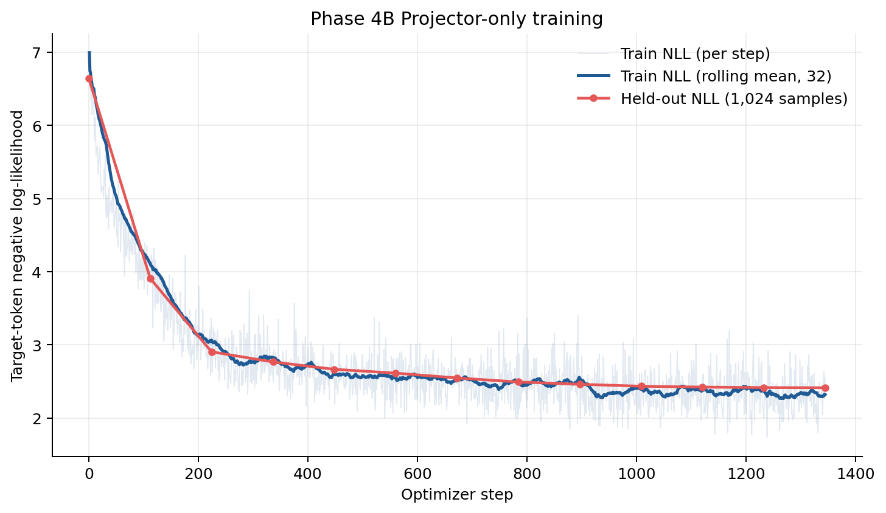
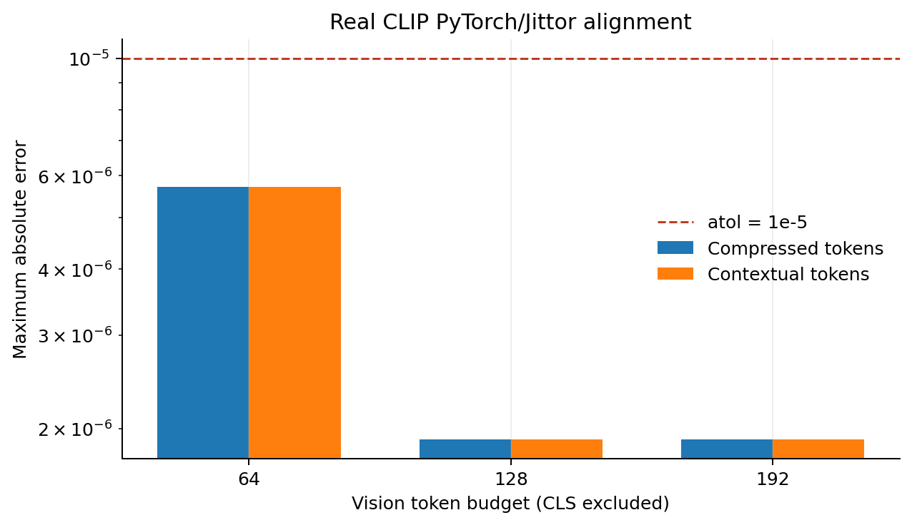
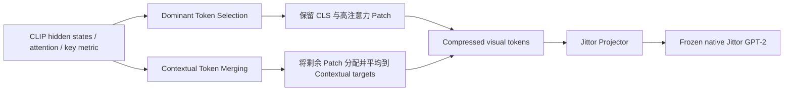
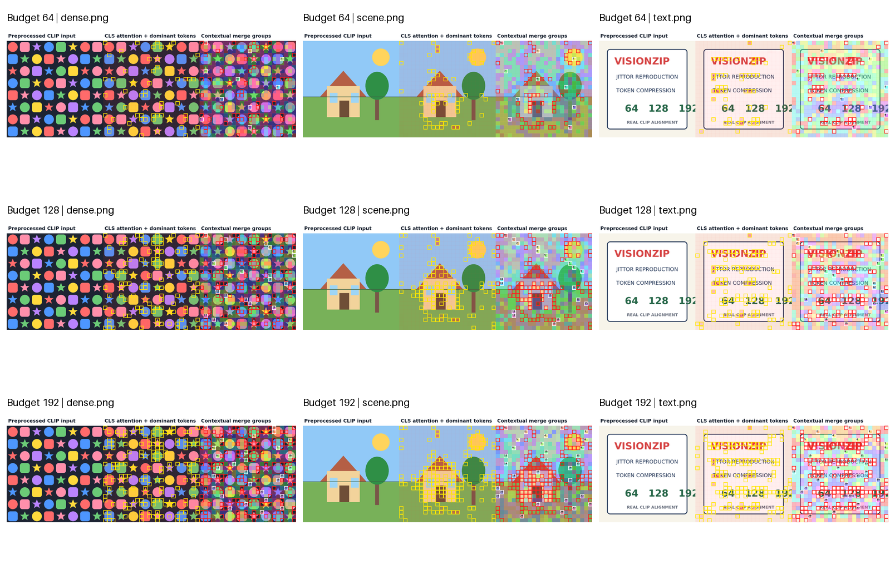
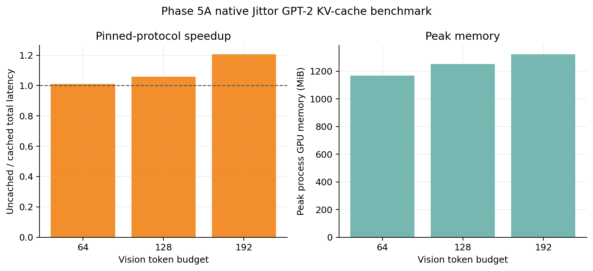

# VisionZip-Jittor

使用 **Jittor 原生张量算子**复现 CVPR 2025 论文 **VisionZip: Longer is Better but Not Necessary in Vision Language Models** 的视觉 Token 压缩核心，并完成真实 CLIP 数值对齐、Projector-only 训练、原生 Jittor GPT-2 Small 与 KV-cache 验证。

[论文（CVF）](https://openaccess.thecvf.com/content/CVPR2025/html/Yang_VisionZip_Longer_is_Better_but_Not_Necessary_in_Vision_Language_CVPR_2025_paper.html) · [官方代码](https://github.com/JIA-Lab-research/VisionZip) · [详细结果](docs/RESULTS_SUMMARY.md) · [训练边界](docs/TRAINING_AND_CLAIM_BOUNDARY.md) · [提交检查](docs/SUBMISSION_READINESS.md) · [干净环境验证](docs/CLEAN_README_WALKTHROUGH.md)

> **状态（2026-08-03）**：核心 Jittor 工程复现、真实 CLIP 三档对齐、真实 paired pilot 训练和 KV-cache 验收均已完成。仓库不是 VisionZip 论文全部表格/任务/模型规模的完整复刻；准确结论边界见[范围声明](#12-复现范围与结论边界)。



## 1. 结果摘要

### 1.1 真实 CLIP：PyTorch/Jittor 对齐

`openai/clip-vit-large-patch14-336`、FP32、3 张真实输入、RTX 4090：

| Vision 预算（不含 CLS） | 实际输出 Token | Selected indices | Assignments | Compressed max abs | 结论 |
|---:|---:|---|---|---:|---|
| 64 | 65 | 100% exact | 100% exact | `5.722046e-06` | PASS |
| 128 | 129 | 100% exact | 100% exact | `1.907349e-06` | PASS |
| 192 | 193 | 100% exact | 100% exact | `1.907349e-06` | PASS |

三档均通过冻结的 `atol=1e-5, rtol=1e-5` 协议。完整表见 [`docs/results/phase2_real_clip_alignment.csv`](docs/results/phase2_real_clip_alignment.csv)。



### 1.2 真实配对数据 Projector-only 训练

- 数据：CommonCatalog CC-BY 固定 revision 的 8,192 样本 pilot；
- split：7,168 train / 1,024 validation；
- 训练：冻结 CLIP/VisionZip 特征和 GPT-2 Small，仅更新 Jittor Projector；
- 计划：1,344 optimizer steps，全部完成且更新 finite；
- held-out target NLL：`6.6437166 -> 2.4131878`；
- held-out perplexity：`767.9438 -> 11.1695`；
- GPT-2：全参数 stop-grad，训练前后 SHA256 不变；
- optimizer scope：严格等于 Projector 参数集合。

完整训练 trace、validation curve 和机器可读摘要位于 [`docs/results/`](docs/results/README.md)。

### 1.3 原生 Jittor GPT-2 KV-cache

固定协议：64/128/192 三档 × 3 样本、每次生成 32 Token、3 warm-up、10 measured runs。

| Budget | Greedy IDs | Cache contract | 最大逐步 TV | Cached / uncached total | Speedup | Peak GPU |
|---:|---|---|---:|---:|---:|---:|
| 64 | exact 3/3 | exact 3/3 | `2.091176e-05` | `240.8540 / 243.3399 ms` | `1.01032x` | `1168 MiB` |
| 128 | exact 3/3 | exact 3/3 | `3.505422e-05` | `241.4139 / 255.4643 ms` | `1.05820x` | `1250 MiB` |
| 192 | exact 3/3 | exact 3/3 | `1.598436e-05` | `241.0673 / 290.8731 ms` | `1.20661x` | `1322 MiB` |

性能只对应固定 RTX 4090/Jittor/长度协议；`require_speedup=false`，不声称通用加速。

### 1.4 PyTorch/Jittor 与训练完整性总表

| 阶段 | 对齐或完整性对象 | 结果 | 边界 |
|---|---|---|---|
| Phase 1 | 独立 PyTorch 参考 vs 原生 Jittor 核心 | 索引 exact，FP32 allclose | 合成张量与完整 CLIP shape |
| Phase 2 | 真实 CLIP 特征上的 VisionZip | 64/128/192 三档 PASS，Assignments exact | 3 张固定测试图 |
| Phase 3B | Hugging Face GPT-2 vs 原生 Jittor GPT-2 | reference logits allclose；max abs `2.136230e-04` | 固定 GPT-2 Small prompt/artifacts |
| Phase 4B | Projector-only 训练隔离 | GPT-2 hash unchanged；optimizer scope exact；1,344/1,344 finite | 固定 8,192 样本 pilot |
| Phase 5A | cached vs uncached decode | 9/9 greedy IDs、cache contract、TV gate 全部通过 | 固定 RTX 4090、3 样本、32 Token |

完整数值和口径见 [`docs/RESULTS_SUMMARY.md`](docs/RESULTS_SUMMARY.md)，机器可读汇总见 [`docs/results/submission_results.json`](docs/results/submission_results.json)。

## 2. 方法概览

VisionZip 在视觉编码器中间层把原始 Patch Token 压缩为少量信息密集 Token：



### 2.1 Dominant Token Selection

1. 读取 CLIP 倒数第二层 attention；
2. 对 `CLS -> Patch` attention 在 head 维求和；
3. 选择 Top-k dominant patches；
4. 额外保留 CLS；
5. 按原视觉序列顺序输出 dominant tokens。

### 2.2 Contextual Token Merging

1. 从未保留位置中按固定规则选择 contextual targets；
2. 对 CLIP `k_proj` 的 head-mean metric 做 L2 normalization；
3. 计算 merge token 与 target token 的 cosine similarity；
4. argmax 分配；
5. 按官方 `code_exact` 语义，对被分配的 merge tokens 求平均生成 contextual tokens。

核心实现：[`visionzip_jittor/core.py`](visionzip_jittor/core.py)。独立 PyTorch 参考：[`reference/pytorch_visionzip.py`](reference/pytorch_visionzip.py)。

## 3. Token 预算口径

配置中的 `dominant_tokens + contextual_tokens` **不包括 CLS**：

| 配置 | Dominant patches | Contextual | 配置预算 | 实际输出（含 CLS） | 来源 |
|---|---:|---:|---:|---:|---|
| [`visionzip_64.json`](configs/visionzip_64.json) | 54 | 10 | 64 | 65 | 官方 README 54:10 设置 |
| [`visionzip_128.json`](configs/visionzip_128.json) | 108 | 20 | 128 | 129 | 项目 2x 比例扩展 |
| [`visionzip_192.json`](configs/visionzip_192.json) | 162 | 30 | 192 | 193 | 项目 3x 比例扩展 |

128/192 是项目 preset，不宣称为论文官方 split。

## 4. 上游版本

核心逻辑固定到：

```text
Repository: JIA-Lab-research/VisionZip
Branch: main
Commit: 8f86b55c6f000eb033e6912538af2dd7dcb30502
Snapshot date: 2026-08-01
```

详见 [`references/UPSTREAM.md`](references/UPSTREAM.md)。本仓库没有复制官方 LLaVA 代码；PyTorch 参考模块仅用于框架对齐。

## 5. 环境安装

### 5.1 已验证环境

| 组件 | 版本 |
|---|---|
| OS | Ubuntu 22.04.1 LTS |
| Python | 3.10.20（Jittor 环境） |
| Jittor | 1.3.11.0 |
| PyTorch reference | 2.1.2+cu118 |
| Transformers | 4.31.0 |
| CUDA Toolkit used by Jittor | 11.8.89 |
| GPU | NVIDIA GeForce RTX 4090 24GB, `sm_89` |

`nvidia-smi` 显示的驱动支持 CUDA 版本可能高于 Jittor 实际编译所用的 CUDA Toolkit；本项目实际 Jittor cache key 为 CUDA 11.8 / `sm_89`。

### 5.2 推荐双环境

PyTorch/Hugging Face 参考导出环境：

```bash
/root/miniconda3/bin/python -m pip install -r requirements/pytorch.txt
/root/miniconda3/bin/python -m pip install -r requirements/real_clip.txt
/root/miniconda3/bin/python -m pip install -r requirements/phase3b_reference.txt
```

Jittor 环境：

```bash
source /root/miniconda3/etc/profile.d/conda.sh
conda create -p /root/autodl-tmp/envs/visionzip-jittor python=3.10 -y
conda activate /root/autodl-tmp/envs/visionzip-jittor
python -m pip install -r requirements/jittor.txt
python -m pip install -r requirements/phase3b_jittor.txt
python -m pip install -r requirements/dev.txt
```

激活脚本默认使用 `/root/autodl-tmp/envs/visionzip-jittor`，但会根据脚本自身位置进入对应 checkout。需要做独立环境验证时可覆盖环境和缓存目录：

```bash
export VISIONZIP_JITTOR_ENV=/root/autodl-tmp/envs/visionzip-readme-clean
export VISIONZIP_CACHE_ROOT=/root/autodl-tmp/cache
source environment/activate_jittor.sh
```

因此从临时 clone/worktree 调用脚本时，不会跳回主工作区。

数据准备依赖安装在 PyTorch/下载环境：

```bash
/root/miniconda3/bin/python -m pip install -r requirements/phase4b_prepare.txt
```

每次 AutoDL 开机：

```bash
source /root/autodl-tmp/VisionZip-Jittor/environment/activate_jittor.sh
```

如 Hugging Face Xet 返回 401，可在当前 shell 使用：

```bash
source /etc/network_turbo
export HF_HUB_DISABLE_XET=1
export HF_HUB_ETAG_TIMEOUT=60
export HF_HUB_DOWNLOAD_TIMEOUT=600
```

## 6. 测试

### 6.1 Windows/无 Jittor 静态与 PyTorch 测试

```powershell
cd C:\Users\69444\Desktop\cmm\VisionZip-Jittor
python -m unittest discover -s tests -v
python -m compileall -q scripts visionzip_jittor reference
```

### 6.2 AutoDL/Jittor 完整测试

```bash
cd /root/autodl-tmp/VisionZip-Jittor
source environment/activate_jittor.sh
python -m unittest discover -s tests -v
```

提交材料 commit `7c1d45f` 的验证结果：Windows discovery 为 `Ran 77 tests`, `OK (skipped=18)`；AutoDL/Jittor 首次 discovery 遇到已知的间歇性 Jittor segfault，受影响的 Phase 3 测试随后独立通过 `2/2`，完整 retry 通过 `Ran 77 tests`, `OK (skipped=8)`，且 `compileall`、`git diff --check` 均通过。首次失败和成功重试日志保留在 AutoDL 的 `logs/submission_readiness/`，不纳入 Git。

最终提交前又在独立 GitHub checkout 与 fresh conda prefix 上完成 README walkthrough：`Ran 80 tests`, `OK (skipped=8)`，合成对齐、真实 CLIP 64/128/192、真实 GPT-2 smoke 和 Phase 4B preflight 全部通过。命令、环境、边界与日志 SHA256 见 [`docs/CLEAN_README_WALKTHROUGH.md`](docs/CLEAN_README_WALKTHROUGH.md)。

## 7. PyTorch/Jittor 对齐

### 7.1 小规模参考

```bash
/root/miniconda3/bin/python scripts/export_pytorch_reference.py \
  --config configs/visionzip_64.json \
  --output outputs/reference_64.npz

python scripts/run_jittor_alignment.py \
  --reference outputs/reference_64.npz \
  --output-json logs/alignment_64.json
```

### 7.2 真实 CLIP 一键流水线

?????????? Git????????????? 3 ? license-free ???

```bash
/root/miniconda3/bin/python scripts/create_sample_images.py \
  --output-dir assets/sample_images
```

?????? CLIP ??????

```bash
set -o pipefail
HF_HUB_DISABLE_XET=1 python scripts/run_real_clip_pipeline.py \
  --torch-python /root/miniconda3/bin/python \
  --jittor-python /root/autodl-tmp/envs/visionzip-jittor/bin/python \
  --image-dir assets/sample_images \
  --model-name-or-path openai/clip-vit-large-patch14-336 \
  --cache-dir /root/autodl-tmp/cache/huggingface \
  --device cuda \
  --dtype float32 \
  2>&1 | tee logs/real_clip/full_pipeline_console.log
```

该流水线导出真实 CLIP hidden states、attention、head-mean key metric，运行 Jittor 三档对齐并生成 Token 可视化。



数值诊断说明见 [`docs/PHASE2_REAL_CLIP.md`](docs/PHASE2_REAL_CLIP.md)。最初 64-token 路径因 near-tie 出现 4 个 Assignment mismatch；根因不是 BMM，而是 Jittor 与 PyTorch CUDA reduction/division 的 FP32 舍入路径。项目使用专用 CUDA normalization 后实现 exact norm、exact normalized metric、exact similarity 和 exact Assignment。

## 8. 真实 GPT-2 与 Projector

### 8.1 导出 Hugging Face GPT-2 artifacts

```bash
HF_HUB_DISABLE_XET=1 /root/miniconda3/bin/python \
  scripts/export_gpt2_jittor_artifacts.py \
  --model-name-or-path openai-community/gpt2 \
  --cache-dir /root/autodl-tmp/cache/huggingface \
  --output-dir outputs/phase3b/gpt2
```

导出结果包含 FP32 weights、HF config、tokenizer、reference logits 和 SHA256 manifest。权重约 475 MiB，不提交到 GitHub。

### 8.2 真实 LLM smoke

```bash
python scripts/run_phase3b_gpt2.py \
  --config configs/phase3b_gpt2.json \
  --artifact-dir outputs/phase3b/gpt2 \
  --reference-dir outputs/real_clip \
  --output-json logs/phase3b/gpt2_smoke.json
```

Phase 3B 在 64/128/192 三档全部通过：真实 GPT-2、语言参数 frozen/unchanged、optimizer scope exact、Projector gradient finite、Projector 参数发生更新。该阶段仅证明执行和梯度隔离，不证明 caption quality。

## 9. 数据准备与训练

Phase 4B 使用固定的 CC-BY pilot、确定性 split、row-level attribution 和预计算冻结特征。以下命令均从仓库根目录执行；下载/CLIP 特征导出使用 PyTorch 环境，训练使用 Jittor 环境。

完整许可、过滤、resume 和指标口径见：

- [`docs/PHASE4B_DATASET_PLAN.md`](docs/PHASE4B_DATASET_PLAN.md)；
- [`docs/PHASE4B_REAL_PAIRED_TRAINING.md`](docs/PHASE4B_REAL_PAIRED_TRAINING.md)；
- [`docs/TRAINING_AND_CLAIM_BOUNDARY.md`](docs/TRAINING_AND_CLAIM_BOUNDARY.md)。

### 9.1 数据预检与物化

```bash
# 仅检查配置、磁盘预算和目标路径，不下载。
/root/miniconda3/bin/python scripts/prepare_phase4b_dataset.py \
  --config configs/phase4b_commoncatalog_cc_by_8k.json

# 下载固定 revision 的 pinned shards，并物化 8,192 样本。
/root/miniconda3/bin/python scripts/prepare_phase4b_dataset.py \
  --config configs/phase4b_commoncatalog_cc_by_8k.json \
  --cache-dir /root/autodl-tmp/cache/huggingface \
  --execute
```

生成的 manifest 包含确定性 `7,168 / 1,024` split、source/license/attribution、源对象哈希和嵌入 JPEG 哈希。

### 9.2 冻结 CLIP/VisionZip 特征

```bash
/root/miniconda3/bin/python scripts/precompute_phase4b_features.py \
  --config configs/phase4b_commoncatalog_cc_by_8k.json \
  --dataset-manifest datasets/phase4b/commoncatalog_cc_by_8k/manifest.json \
  --output-dir outputs/phase4b/commoncatalog_cc_by_8k/features \
  --cache-dir /root/autodl-tmp/cache/huggingface \
  --device cuda
```

如 32 个 shards 已生成，可追加 `--verify-existing` 进行 hash、sample order 和 shape 校验，避免重复计算。

### 9.3 Projector-only 训练

```bash
source environment/activate_jittor.sh
tmux new -s visionzip-phase4b

python scripts/run_phase4b_training.py \
  --config configs/phase4b_commoncatalog_cc_by_8k.json \
  --prepared-manifest datasets/phase4b/commoncatalog_cc_by_8k/manifest.json \
  --feature-manifest outputs/phase4b/commoncatalog_cc_by_8k/features/manifest.json \
  --artifact-dir outputs/phase3b/gpt2 \
  --output-dir outputs/phase4b/commoncatalog_cc_by_8k/training \
  --log-dir logs/phase4b/training
```

长训练必须在 `tmux` 中执行。每步 compact log 与 held-out curve 已提交在 [`docs/results/`](docs/results/README.md)，大日志和 checkpoint 只进入证据包。

### 9.4 Checkpoint resume

```bash
python scripts/run_phase4b_training.py \
  --config configs/phase4b_commoncatalog_cc_by_8k.json \
  --prepared-manifest datasets/phase4b/commoncatalog_cc_by_8k/manifest.json \
  --feature-manifest outputs/phase4b/commoncatalog_cc_by_8k/features/manifest.json \
  --artifact-dir outputs/phase3b/gpt2 \
  --output-dir outputs/phase4b/commoncatalog_cc_by_8k/training_resume \
  --log-dir logs/phase4b/training_resume \
  --resume outputs/phase4b/commoncatalog_cc_by_8k/training_benchmark_0f53a93/checkpoints/projector_step_001120.npz
```

Resume 会恢复 Projector 参数和 Adam 一、二阶状态；CUDA 浮点路径按 `1e-5` 数值复现，不声称 bitwise deterministic replay。

## 10. KV-cache 测试与性能

```bash
python scripts/run_phase5a_kv_cache.py \
  --config configs/phase5a_kv_cache.json \
  --artifact-dir outputs/phase3b/gpt2 \
  --projector-checkpoint outputs/phase4b/commoncatalog_cc_by_8k/training_benchmark_0f53a93/best_projector.npz \
  --feature-manifest outputs/phase4b/commoncatalog_cc_by_8k/features/manifest.json \
  --reference-dir outputs/real_clip \
  --output-json logs/phase5a/kv_cache_benchmark.json
```

正式 gate：exact greedy IDs、exact per-layer cache shape/content contract、逐步 probability total-variation `<=5e-5`、GPT-2/Projector frozen 且 hash unchanged。raw/centered logits 和 coordinatewise probability allclose 只作为 diagnostic。



## 11. 提交版结果材料

| 材料 | 路径 |
|---|---|
| 实验总览与主表 | [`docs/RESULTS_SUMMARY.md`](docs/RESULTS_SUMMARY.md) |
| 训练协议与边界 | [`docs/TRAINING_AND_CLAIM_BOUNDARY.md`](docs/TRAINING_AND_CLAIM_BOUNDARY.md) |
| 提交风险清单 | [`docs/SUBMISSION_READINESS.md`](docs/SUBMISSION_READINESS.md) |
| Loss/LR/对齐/KV 图 | [`docs/assets/`](docs/assets/) |
| Compact CSV/JSON logs | [`docs/results/`](docs/results/README.md) |
| 图表重建脚本 | [`scripts/build_submission_assets.py`](scripts/build_submission_assets.py) |

从本地证据包重建图表（Windows PowerShell）：

```powershell
python scripts\build_submission_assets.py `
  --phase2-archive ..\VisionZip-Jittor-phase2-evidence-20260802.tar.gz `
  --phase4a-archive ..\VisionZip-Jittor-phase4a-evidence-20260803.tar.gz `
  --phase4b-archive ..\VisionZip-Jittor-phase4b-evidence-final-v2-20260803.tar.gz `
  --phase5a-archive ..\VisionZip-Jittor-phase5a-evidence-20260803.tar.gz `
  --output-dir docs
```

图表依赖：

```bash
python -m pip install -e ".[submission]"
```

## 12. 复现范围与结论边界

### 本仓库已经证明

- VisionZip 核心算法的原生 Jittor 实现；
- 固定官方逻辑、真实 CLIP 特征和三档预算下的跨框架对齐；
- 原生 Jittor Projector、多模态 packing、GPT-2 Small、checkpoint/resume 和 KV-cache；
- 真实 licensed paired pilot 上 Projector-only 训练与 held-out NLL 下降；
- 固定环境下的训练、显存与缓存生成性能。

### 本仓库没有声称

- 严格复现 VisionZip 论文全部实验表、数据集、任务、消融和模型规模；
- 完整 LLaVA-7B/13B 或 LLaVA-equivalent 端到端质量；
- 人类 caption、COCO 多参考质量或 SOTA；
- raw logits bitwise exact；
- 跨硬件、跨模型、跨长度的 universal strict `1e-5` 或 universal speedup。

培育期规则允许计算资源有限时采用少量数据并与 PyTorch 结果对齐，因此本项目选择“核心算法精确对齐 + 小规模真实训练 + 完整可复现证据链”的范围，不将有限资源结果包装成论文全量复现。

## 13. 项目结构

```text
visionzip_jittor/
  core.py                 # VisionZip compression
  clip_features.py        # CLIP key metric and PyTorch-compatible CUDA norm
  projector.py            # native Jittor multimodal Projector
  gpt2.py                 # native Jittor GPT-2 and KV-cache
  phase4_training.py      # paired packing, loss, checkpoint/resume
  phase4b_data.py         # licensed dataset filtering/split/attribution
  phase4b_features.py     # frozen sharded feature store
  phase4b_training.py     # real paired training/evaluation/benchmark
reference/
  pytorch_visionzip.py    # independent PyTorch alignment reference
scripts/
  run_real_clip_pipeline.py
  run_phase4b_training.py
  run_phase5a_kv_cache.py
  build_submission_assets.py
tests/                    # unit, alignment, training, resume and cache tests
docs/assets/              # committed presentation-ready figures
docs/results/             # compact machine-readable logs
```

## 14. 分阶段文档

- [`docs/PHASE1_RESULTS.md`](docs/PHASE1_RESULTS.md)
- [`docs/PHASE2_REAL_CLIP.md`](docs/PHASE2_REAL_CLIP.md)
- [`docs/PHASE3_PROJECTOR_FROZEN_LLM.md`](docs/PHASE3_PROJECTOR_FROZEN_LLM.md)
- [`docs/PHASE3B_REAL_GPT2.md`](docs/PHASE3B_REAL_GPT2.md)
- [`docs/PHASE4A_PAIRED_TRAINING.md`](docs/PHASE4A_PAIRED_TRAINING.md)
- [`docs/PHASE4B_DATASET_PLAN.md`](docs/PHASE4B_DATASET_PLAN.md)
- [`docs/PHASE4B_REAL_PAIRED_TRAINING.md`](docs/PHASE4B_REAL_PAIRED_TRAINING.md)
- [`docs/PHASE5A_KV_CACHE_PLAN.md`](docs/PHASE5A_KV_CACHE_PLAN.md)

## 15. License

本项目采用 Apache-2.0 License。VisionZip 论文、模型、官方仓库及外部数据集的权利归各自作者和许可声明所有。本仓库用于学习和可复现研究。
