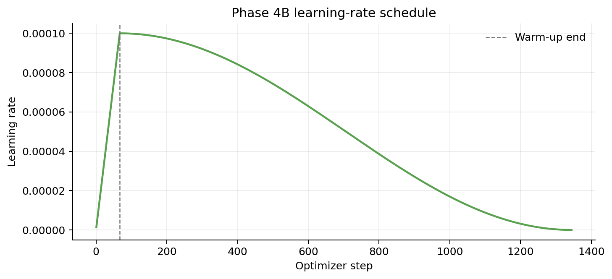

# 提交版实验结果总览

> 本页是面向 README、PPT 和视频的精简结果页。机器可读结果位于 [`docs/results/`](results/)，原始大日志、模型权重、特征 shard 和 checkpoint 不进入普通 Git 历史，而保存在跨主机校验过的阶段证据包中。

## 1. PyTorch/Jittor 对齐总表

### 1.1 真实 CLIP + VisionZip 核心

环境：PyTorch `2.1.2+cu118`、Jittor `1.3.11.0`、RTX 4090、FP32；输入为 3 张项目生成测试图，视觉编码器为 `openai/clip-vit-large-patch14-336`。

| Vision 预算（不含 CLS） | 实际输出 Token | Selected indices | Assignments | Compressed max abs | Contextual max abs | 结论 |
|---:|---:|---|---|---:|---:|---|
| 64 | 65 | 100% exact | 100% exact | `5.722046e-06` | `5.722046e-06` | PASS |
| 128 | 129 | 100% exact | 100% exact | `1.907349e-06` | `1.907349e-06` | PASS |
| 192 | 193 | 100% exact | 100% exact | `1.907349e-06` | `1.907349e-06` | PASS |

完整 CSV：[`phase2_real_clip_alignment.csv`](results/phase2_real_clip_alignment.csv)。三档报告均满足当时冻结的 `atol=1e-5, rtol=1e-5`，并且所有离散选择与归并 Assignment 精确一致。

### 1.2 跨阶段端到端检查

| 路径 | 对齐对象 | 结果 | 正确解释 |
|---|---|---|---|
| Phase 1 | 独立 PyTorch 参考 vs 原生 Jittor 小张量/完整 shape | 索引 exact，浮点 allclose | 验证核心算子和边界条件 |
| Phase 2 | 真实 CLIP 特征上的 VisionZip 64/128/192 | 三档全部 PASS | 验证真实特征与 CUDA near-tie 数值路径 |
| Phase 3B | Hugging Face GPT-2 参考 logits vs 原生 Jittor GPT-2 | max abs `2.136230e-04`，allclose | 验证真实 124M GPT-2 权重导入和前向 |
| Phase 4B | 冻结 GPT-2、仅优化 Projector | GPT-2 hash 不变；optimizer scope exact | 验证训练隔离，不是视觉语言质量对齐 |
| Phase 5A | 原生 Jittor GPT-2 cached vs uncached decode | 9/9 greedy IDs exact；9/9 cache contract exact；TV gate 9/9 | 验证固定协议下的 KV-cache 正确性 |

## 2. Phase 4B 训练结果

训练对象仅为 `1024 -> 768 -> 768` Projector。CLIP、VisionZip 特征和 GPT-2 均被冻结；训练集/验证集为确定性的 `7,168 / 1,024` 划分。

| 指标 | 初始 | 最终 | 变化 |
|---|---:|---:|---:|
| Held-out target NLL | `6.6437166` | `2.4131878` | 降低 `63.68%` |
| Held-out perplexity | `767.9438` | `11.1695` | 降低 `68.75x` |
| Optimizer step | `0` | `1344` | 完成全部计划步数 |

训练曲线数据：

- 每步训练 NLL、32-step 滚动均值、学习率和耗时：[`phase4b_training_trace.csv`](results/phase4b_training_trace.csv)；
- 13 次全量 held-out 评估：[`phase4b_validation_curve.csv`](results/phase4b_validation_curve.csv)；
- 学习率曲线：

### 2.1 训练完整性

| 检查 | 结果 |
|---|---|
| 1,344 个 optimizer updates 全部 finite | `true` |
| GPT-2 全参数 stop-grad | `true` |
| GPT-2 训练前后 SHA256 不变 | `true` |
| optimizer scope 严格等于 Projector 参数 | `true` |
| evaluation 后恢复 Projector 可训练状态 | `true` |
| fresh run 与显式 checkpoint resume smoke | `passed` |

### 2.2 固定环境性能

RTX 4090、Jittor `1.3.11.0`、warm-up 后 1,277 个 optimizer steps：

| 指标 | 数值 |
|---|---:|
| Mean optimizer-step compute | `120.3718 ms` |
| Effective samples/s | `132.9215` |
| Target tokens/s | `1413.1492` |
| 当前进程峰值 GPU 显存 | `3058 MiB` |

此处吞吐量排除了模型加载、启动、评估、checkpoint I/O 和生成；不能解释为端到端数据准备或生产推理吞吐。

## 3. Phase 5A KV-cache

固定协议：每档 3 个样本、生成 32 Token、3 次 warm-up、10 次 measured run；`require_speedup=false`，性能仅作为当前 RTX 4090/Jittor 环境的观测。

| Budget | Cases | Greedy IDs | Cache contract | 最大逐步 TV | Cached total | Uncached total | Speedup | Peak GPU |
|---:|---:|---|---|---:|---:|---:|---:|---:|
| 64 | 3 | exact | exact | `2.091176e-05` | `240.8540 ms` | `243.3399 ms` | `1.01032x` | `1168 MiB` |
| 128 | 3 | exact | exact | `3.505422e-05` | `241.4139 ms` | `255.4643 ms` | `1.05820x` | `1250 MiB` |
| 192 | 3 | exact | exact | `1.598436e-05` | `241.0673 ms` | `290.8731 ms` | `1.20661x` | `1322 MiB` |

完整 CSV：[`phase5a_kv_cache_summary.csv`](results/phase5a_kv_cache_summary.csv)。

## 4. Token 可视化

下图汇总 64/128/192 三档和 3 张测试图的 Dominant Token 与 Contextual Merge 可视化。原始 9 张图保存在 Phase 2 证据包；此处提交的是便于 GitHub/PPT 查看的一张压缩 montage。

## 5. 结论边界

### 已验证

- 原生 Jittor VisionZip 核心算法；
- 真实 CLIP 特征上的 PyTorch/Jittor 数值和离散决策对齐；
- 原生 Jittor Projector、多模态 packing、GPT-2 Small 和 KV-cache；
- 冻结 GPT-2、仅训练 Projector 的真实配对数据训练基础设施；
- 固定 8,192 样本 pilot 上 held-out target NLL 的可重复下降；
- 固定 RTX 4090/Jittor 协议下的训练和 KV-cache 性能记录。

### 未验证，禁止扩张表述

- 没有复现 VisionZip 论文全部数据集、模型规模、任务、表格与消融；
- 没有运行完整 LLaVA-7B/13B，也不声称 LLaVA-equivalent；
- 单一 BLIP-2 synthetic reference 的 BLEU/ROUGE 不能与多参考 COCO 指标直接比较；
- 不声称人类标注 caption quality 或 SOTA；
- Phase 5A 不声称 raw-logit bitwise exact、通用 strict `1e-5` 或通用加速。

更详细的训练协议和解释见 [`TRAINING_AND_CLAIM_BOUNDARY.md`](TRAINING_AND_CLAIM_BOUNDARY.md)。
